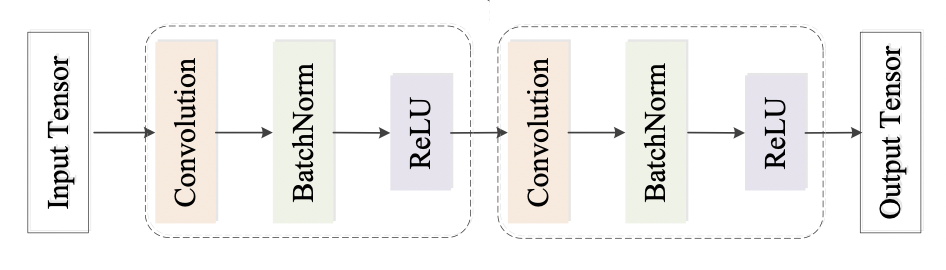

## Final Project cs589

This is a sudoku solver neural network using CNN architecture.

### Final report

| File               | Description                                                                     |
|:-------------------|:--------------------------------------------------------------------------------|
| **preprocess.py**  | This file creates saved numpy raw dataset format                                |
| **create_data.py** | This creates training and test set from saved dataset                           |
| **model.py**       | This is the model architecture using CNN + BatchNorm + ReLU                     | 
| **train.py**       | Training model with checkpoints and tensorboard for loss/accuarcy graphs        |
| **evaluate.py**    | create a unsolved puzzle and evaluate the correctness of the predicted solution |

### Architecture
The baseline is that I use CNN + BatchNorm + ReLU to extract the feature better than using CNN only. The input is a puzzle with a shape of (9,9,1). The kernel is (3,3), and padding is set to "same" since I don't want the puzzle shape to reduce. The last CNN layer has a filter of 9 since each predicted number has 9 different possibilities. The other CNN layers can have different filters in (32,128,512). I use at most 7 (CNN + BatchNorm + ReLU) blocks and at least 2 for model sizes, each model with a different filter. I tested on 4 other models with different hyperparameters. Also, I try 2 types of optimizers (Adam, SGD), but it seems like Adam is a better option. The detailed report is below.

&nbsp;

&nbsp;

&nbsp;

&nbsp;

&nbsp;

&nbsp;

### Result Table 

| Model | #blocks CNN | Channels | Optimizer |  Train/valid accuracy   |  Train/valid loss   | Lr (α) | Epochs | Batch | Parameters |
|:-----:|:-----------:|:--------:|:---------:|:-----------------------:|:-------------------:|:------:|:------:|:-----:|:----------:|
|   1   |      3      |    32    |    SDG    |      0.5655/0.5652      |    0.960/0.9762     |  0.02  |   15   |  32   |    20K     |
|   2   |      3      |    32    |   Adam    |      0.5687/0.5659      |    0.9516/0.9551    |  0.02  |   15   |  32   |    20K     |
|   3   |      6      |   128    |   Adam    |      0.9036/0.9005      |    0.2188/0.2256    |  0.01  |   18   |  64   |    891K    |
|   4   |      7      |   256    |   Adam    |  **0.9250/0.9139**      | **0.1698/0.1950**   |  0.01  |   18   |  64   |    3.5M    |

We can see that with the same model in 1 and 2, but with a different optimizer, the model's accuracy with the Adam optimizer is a bit higher, and the loss is also lower. Therefore, I decided to pick the Adam for the rest model. Also, we can see that scaling can undoubtedly increase the model performance; with 128 channels, CNN already has a significant boost in accuracy compared to the 32 channels. The performance of the 256 channels is also the highest, with the loss being the lowest. Although the largest model has a significantly long training time, it will be the largest one due to its impressive performance if I want to deploy the model.

### Graphs
Note: Blue line is for training, and orange is validation
####Model 1

          

####Model 2

          

####Model 3

          

####Model 4

          

Overall, when we look at the graphs, it does seem like the first three models are overfitting; the loss and accuracy in all graphs converge after epoch 15. The last two models are performing very well, with accuracy above 90% and loss below 0.22. The largest model is slightly overfitting since the training accuracy is 1% higher than the validation accuracy, and the loss gap is 0.3.

### References
The [**dataset**](https://www.kaggle.com/datasets/bryanpark/sudoku) for this project.
Tools for this project
- TensorFlow
- Numpy
- Matplotlib

### Saved model
I saved the trained model on my [**github**](https://github.com/tai-dang11/solver_sudoku.git)